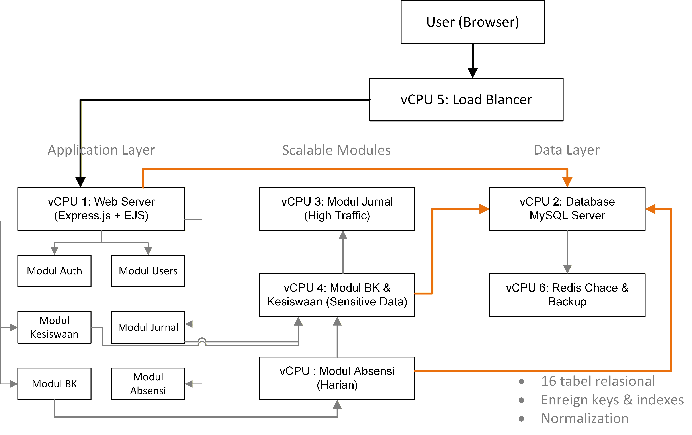
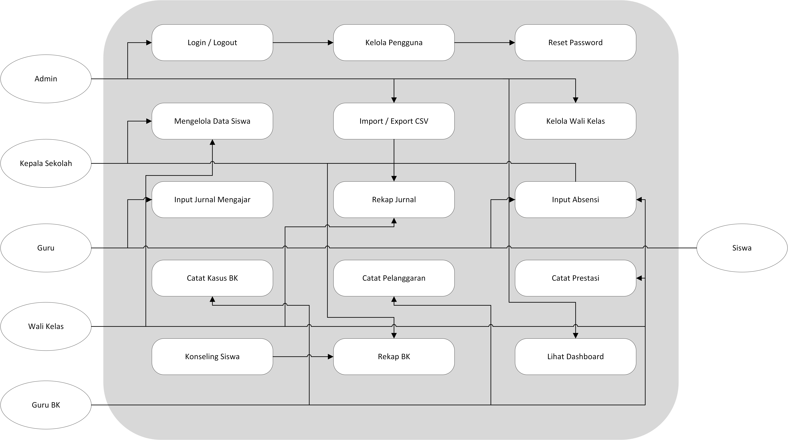
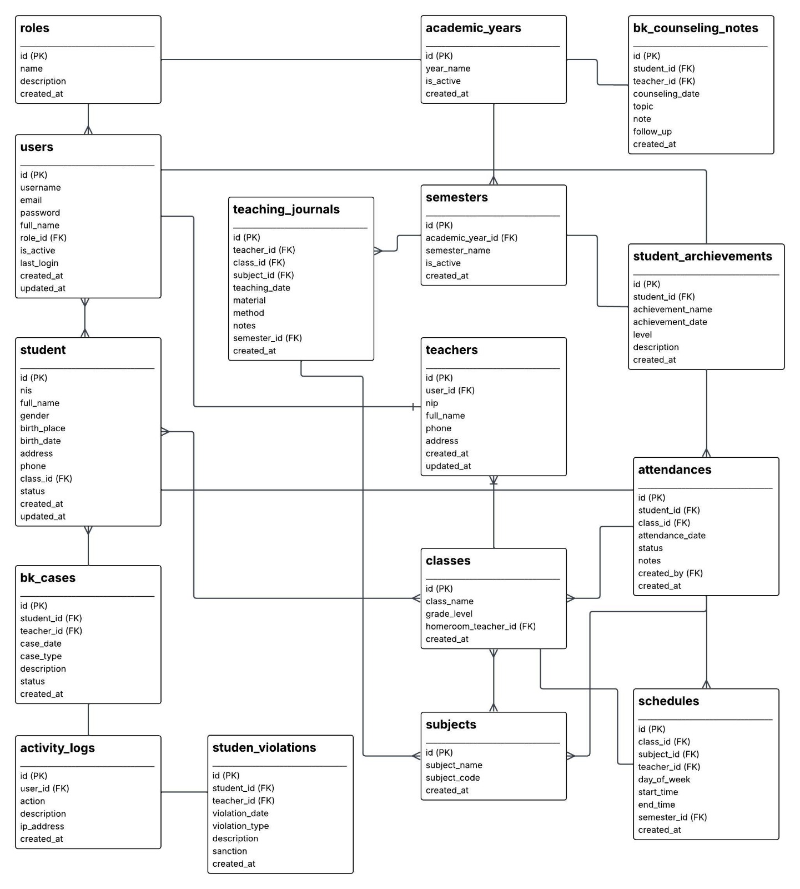

# MID-SSD-Web-Sekolah-Kelompok-5

**Web Sekolah Terintegrasi Berbasis Scalable System Design**

Mata Kuliah: RPL-A Scalable System Design

---

## Nama Anggota Kelompok

| No | Nama | NIM | Peran |
|----|------|-----|-------|
| 1 | Ashabul Kahfi | 105841108523 | System Analyst / Project Lead |
| 2 | Marhepi Rahmadani | 105841109523 | System Architect |
| 3 | Muh. Eka Andri Setiawan | 105841110723 | Database Designer |
| 4 | Afra Muawiya | 105841108423 | UI/UX & Documentation Designer |
| 5 | Alyah Saputri Bakri | 105841107723 | Security & Access Control Designer |

---

## Pembagian Tugas

| No | Nama | NIM | Peran | Tugas Pokok | Commit Unggulan |
|----|------|-----|-------|-------------|-----------------|
| 1 | **Ashabul Kahfi** | 105841108523 | System Analyst / Project Lead | Dokumen analisis sistem, use case diagram, inisialisasi project MVC modular, dashboard + grafik Chart.js + live clock, theme Apple monochrome, modul Absensi & Jurnal, data seed 50+ jurnal, deployment Oracle Cloud + Nginx + PM2 + HTTPS | `f2e09c9` Init project | `e04a9e3` Docs system analysis | `0171468` Dashboard + grafik | `a09c090` Theme Apple | `0fc5aeb` Modul Absensi | `cf039db` Rekap Jurnal | `11213b2` Profil & Ganti Password | `4527d10` Search bar | `72731bd` Pagination | `0133f81` `a69177e` `bb2d8fc` Search suggestion AJAX | `63c921f` Seed 50+ jurnal | `cad66f6` Dashboard Siswa (co-author) | `8cd0bb5` Date Range Filter (co-author) |
| 2 | **Marhepi Rahmadani** | 105841109523 | System Architect | Dokumen arsitektur detail, struktur folder MVC modular, modul BK (4 sub-modul + rekap BK), reset password, search suggestion AJAX, perbaikan bug | `f521b4c` Docs arsitektur detail | `b12a7b0` `1e2a6e7` Modul BK + Rekap BK | `5a0850e` Reset Password (co-author) | `a69177e` `bb2d8fc` `c13cd47` `9fcd3ab` Search suggestion + fix |
| 3 | Muh. Eka Andri Setiawan | 105841110723 | Database Designer | Dokumen database spesifikasi, kelola wali kelas, search bar, pagination, schema 16 tabel + relasi | `298cd02` Docs database spesifikasi | `c3a151b` `d9ebcb3` Kelola Wali Kelas | `4527d10` Search bar (co-author) | `72731bd` Pagination (co-author) |
| 4 | Afra Muawiya | 105841108423 | UI/UX & Documentation Designer | Dokumen UI/UX design, laporan HTML 22 section, pembagian tugas, naskah video, import CSV, responsive CSS, dashboard siswa, README | `2125f6c` Docs UI/UX design | `b9e6272` Laporan HTML | `f7a5a10` `1799c59` Import CSV | `585483a` Responsive CSS | `cad66f6` Dashboard Siswa (co-author) |
| 5 | Alyah Saputri Bakri | 105841107723 | Security & Access Control Designer | Dokumen keamanan RBAC, middleware auth.js & rbac.js, export CSV, use case diagram, date range filter, audit log activity_logs | `980eac2` Docs RBAC | `ef280a1` `9f2ada3` Use case diagram | `71f6d30` `40ca64e` Export CSV | `8cd0bb5` Date Range Filter (co-author) |

---

## Daftar Modul

1. **Modul Manajemen Pengguna** - Login, logout, manajemen akun & role, audit log, reset password
2. **Modul Data Kesiswaan** - CRUD siswa, kelola kelas, wali kelas, status siswa, import/export CSV
3. **Modul Jurnal Mengajar** - Input jurnal, pilih kelas/mapel, riwayat, rekap jurnal
4. **Modul Bimbingan Konseling (BK)** - Catatan konseling, kasus, pelanggaran, prestasi, rekap BK
5. **Modul Absensi** - Input kehadiran per kelas/tanggal, rekap absensi per siswa dengan persentase

---

## Teknologi yang Digunakan

| Komponen | Teknologi |
|----------|-----------|
| Frontend | HTML, CSS, JavaScript, Bootstrap 5, Bootstrap Icons |
| Backend | Node.js, Express.js |
| Database | MySQL |
| Template Engine | EJS |
| Session | express-session |
| Password | bcryptjs |
| Tools | Git, GitHub, Draw.io, Visual Studio Code |

---

## Struktur Folder

```
MID-SSD-Web-Sekolah-Kelompok2/
├── database/
│   ├── schema.sql          # Struktur database
│   ├── seed.sql            # Data dummy (SQL)
│   └── seed.js             # Seeder dengan password hash
├── docs/
│   ├── arsitektur.png      # Diagram arsitektur sistem
│   ├── arsitektur.drawio   # Source diagram draw.io
│   ├── ERD.png             # Entity Relationship Diagram
│   ├── ERD.drawio          # Source ERD draw.io
│   ├── use-case.png        # Use case diagram
│   ├── use-case.drawio     # Source use case draw.io
│   ├── analisis_sistem.md  # Dokumentasi System Analyst
│   ├── arsitektur_detail.md # Dokumentasi System Architect
│   ├── database_spesifikasi.md # Dokumentasi Database Designer
│   ├── ui_ux_desain.md     # Dokumentasi UI/UX Designer
│   ├── keamanan_rbac.md    # Dokumentasi Security Designer
│   └── naskah_video.md     # Naskah presentasi YouTube
├── src/
│   ├── app.js              # Entry point
│   ├── config/
│   │   └── database.js     # Koneksi MySQL
│   ├── middleware/
│   │   ├── auth.js         # Middleware autentikasi
│   │   └── rbac.js         # Middleware role-based access
│   ├── modules/
│   │   ├── auth/           # Login & logout
│   │   ├── dashboard/      # Dashboard utama
│   │   ├── users/          # Manajemen pengguna
│   │   ├── kesiswaan/      # Data kesiswaan
│   │   ├── jurnal/         # Jurnal mengajar
│   │   ├── bk/             # Bimbingan konseling
│   │   └── absensi/        # Absensi siswa
│   ├── public/
│   │   ├── css/style.css
│   │   └── js/script.js
│   └── views/
│       ├── layouts/
│       ├── auth/
│       ├── dashboard/
│       ├── users/
│       ├── kesiswaan/
│       ├── jurnal/
│       ├── bk/
│       └── absensi/
├── .env.example
├── .gitignore
├── package.json
└── README.md
```

---

## Rancangan Arsitektur Sistem



### Use Case Diagram



**6 Aktor:** Admin, Kepala Sekolah, Guru, Wali Kelas, Guru BK, Siswa
**15 Use Case:** Login, Kelola User, Reset Password, Kelola Siswa, Import/Export CSV, Wali Kelas, Input Jurnal, Rekap Jurnal, Absensi, Kasus BK, Pelanggaran, Prestasi, Konseling, Rekap BK, Dashboard

### Deskripsi Arsitektur:
- **Modular Monolith Architecture**: Sistem dibagi menjadi modul-modul terpisah (auth, users, kesiswaan, jurnal, bk, absensi) tetapi berjalan dalam satu aplikasi.
- **Centralized Database**: Semua modul menggunakan satu database MySQL.
- **Middleware-based Routing**: Setiap modul memiliki router sendiri dengan middleware autentikasi dan RBAC.
- **Session-based Authentication**: Menggunakan express-session untuk manajemen login.

### Pembagian vCPU (Server Virtual):

| vCPU | Layanan | Alasan |
|------|---------|--------|
| vCPU 1 | Web Server (Aplikasi Utama) | Menangani semua request HTTP |
| vCPU 2 | Database Server (MySQL) | Penyimpanan data terpusat |
| vCPU 3 | Modul Jurnal Mengajar | Dipisahkan karena akses harian tinggi |
| vCPU 4 | Modul BK & Kesiswaan | Data sensitif dipisahkan |
| vCPU 5 | Load Balancer & Monitoring | Distribusi beban dan pemantauan |
| vCPU 6 | Backup & Caching (Redis) | Performa dan keamanan data |

---

## Rancangan Database

Database: `db_sekolah_ssd`

### Minimal 16 Tabel:

1. **roles** - Role pengguna (admin, guru, bk, siswa, dll)
2. **users** - Data akun pengguna
3. **academic_years** - Tahun ajaran
4. **semesters** - Semester
5. **teachers** - Data guru
6. **classes** - Data kelas
7. **subjects** - Mata pelajaran
8. **students** - Data siswa
9. **schedules** - Jadwal pelajaran
10. **teaching_journals** - Jurnal mengajar
11. **bk_cases** - Kasus BK
12. **bk_counseling_notes** - Catatan konseling
13. **student_violations** - Pelanggaran siswa
14. **student_achievements** - Prestasi siswa
15. **activity_logs** - Log aktivitas
16. **attendances** - Absensi kehadiran siswa

### Relasi Utama:
- `users.role_id` → `roles.id`
- `students.class_id` → `classes.id`
- `teachers.user_id` → `users.id`
- `teaching_journals.teacher_id` → `teachers.id`
- `bk_cases.student_id` → `students.id`
- Semua modul berbagi data siswa, guru, kelas, dan mata pelajaran dari tabel yang sama.

### ERD:


---

## Cara Instalasi

### Prasyarat
- Node.js v16+
- MySQL 5.7+ / MariaDB 10+
- npm

### Langkah-langkah

1. **Clone repository**
   ```bash
   git clone https://github.com/Kahfi10/MID-SSD-Web-Sekolah-Kelompok-5.git
   cd MID-SSD-Web-Sekolah-Kelompok-5
   ```

2. **Install dependencies**
   ```bash
   npm install
   ```

3. **Konfigurasi database**
   - Copy `.env.example` menjadi `.env`
   - Sesuaikan konfigurasi database di file `.env`

4. **Buat database dan seed data**
   ```bash
   node database/seed.js
   ```
   Atau manual:
   ```sql
   mysql -u root -p < database/schema.sql
   mysql -u root -p < database/seed.sql
   ```

5. **Jalankan aplikasi**
   ```bash
   npm start
   ```

6. **Akses di browser**
   ```
   http://localhost:3000
   ```

---

## Cara Menjalankan Aplikasi

### Development
```bash
npm run dev
```

### Production
```bash
npm start
```

Server akan berjalan di `http://localhost:3000`.

---

## Akun Login Demo

| Role | Username | Password |
|------|----------|----------|
| Admin | admin | password123 |
| Kepala Sekolah | kepsek | password123 |
| Guru | guru1 | password123 |
| Guru BK | guru_bk | password123 |
| Wali Kelas | walas1 | password123 |
| Siswa | siswa1 | password123 |
| Orang Tua | ortu1 | password123 |

---

## Link Video Presentasi YouTube

**https://youtu.be/IB4w8m3ZZxg?si=7c7Yu9miWObtODnD**

## Link Demo Online

Akses aplikasi: **https://web-sekolah.duckdns.org**

---

## Penjelasan Unsur Scalable System Design

### 1. Modular Architecture
Sistem dibagi menjadi modul-modul terpisah (auth, users, kesiswaan, jurnal, bk). Setiap modul memiliki router dan view sendiri, sehingga mudah dikembangkan tanpa mengganggu modul lain.

### 2. Centralized Database
Semua modul menggunakan satu database MySQL (`db_sekolah_ssd`). Data siswa cukup disimpan sekali dan dapat digunakan oleh semua modul.

### 3. Load Balancing
Rancangan vCPU memisahkan layanan ke server virtual berbeda. Load balancer (vCPU 5) mendistribusikan request pengguna ke server yang tepat.

### 4. Horizontal Scaling
Jika modul Jurnal Mengajar mengalami lonjakan akses, dapat ditambah instance server baru tanpa mengganggu modul lain.

### 5. Vertical Scaling
Server database dapat ditingkatkan kapasitas RAM/CPU jika data semakin besar.

### 6. API-Based Integration
Meskipun saat ini modular monolith, setiap modul dirancang dengan interface yang jelas sehingga dapat dipisah menjadi service terpisah di masa depan.

### 7. Role-Based Access Control (RBAC)
Middleware `rbac.js` membatasi akses berdasarkan role pengguna. Hanya pengguna dengan role tertentu yang dapat mengakses modul tertentu.

### 8. Database Optimization
- Index pada kolom yang sering di-query (student_id, teacher_id, class_id, subject_id)
- Relasi foreign key yang jelas
- Query yang efisien

### 9. Caching
Rencana implementasi Redis untuk cache data yang sering diakses (daftar kelas, guru, mapel, jadwal).

### 10. Monitoring & Logging
Tabel `activity_logs` mencatat semua aktivitas pengguna. Dashboard menampilkan aktivitas terbaru untuk monitoring.

---

## Lisensi

Proyek ini dibuat dengan hati ❤️ untuk keperluan Ujian MID Semester mata kuliah Scalable System Design.
